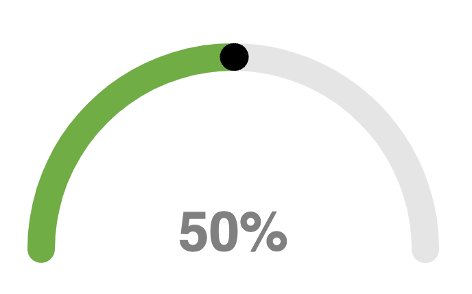
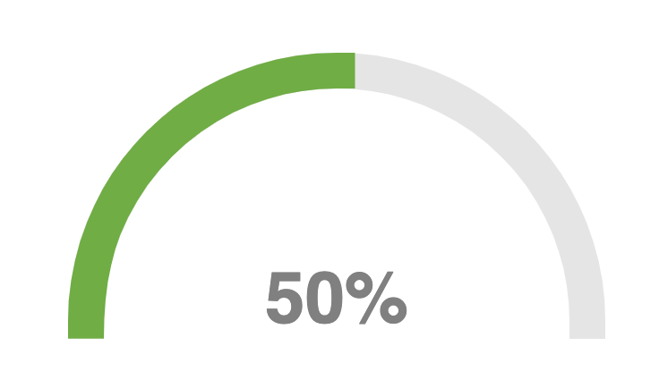
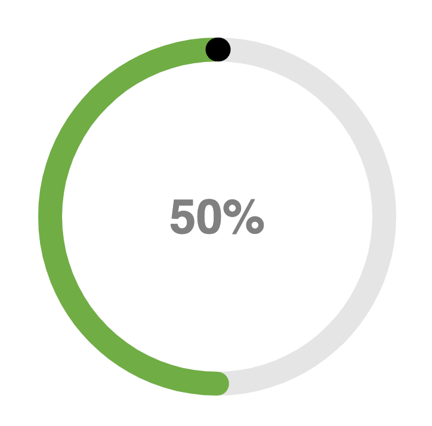

# react-gauges
[](https://www.npmjs.com/package/react-gauges)

This library provides a set of reusable gauge components for use in React applications.

## Installation

To install the library, run the following command:

```bash
npm install react-gauges
```

## Usage

To use the library in your React application, import the desired gauge component and pass in the necessary props. Here's an example of how to use the `SimpleGauge` component:



```jsx
import { SimpleGauge } from "react-gauges";

function App() {
  return (
    <div>
      <SimpleGauge value={50} />
    </div>
  );
}
```



```jsx
import { SimpleGauge } from "react-gauges";

function App() {
  return (
    <div>
      <SimpleGauge value={50} borderType="square" indicatorVisible={false} />
    </div>
  );
}
```



```jsx
import { SimpleGauge } from "react-gauges";

function App() {
  return (
    <div>
      <SimpleGauge value={50} isTotal={true} />
    </div>
  );
}
```


## Options

| Option           | type    | Description                                   | Example                    |
| ---------------- | ------- | --------------------------------------------- | -------------------------- |
| value            | number  | The value to display on the gauge             | `value={75}`               |
| minLimit         | number  | The minimum value of the gauge                | `minLimit={0}`             |
| maxLimit         | number  | The maximum value of the gauge                | `maxLimit={100}`           |
| barColor         | string  | The color of the gauge bar                    | `barColor="#00ff00"`       |
| barBaseColor     | string  | The color of the gauge bar base               | `barBaseColor="#000000"`   |
| barWidth         | number  | The width of the gauge bar                    | `barWidth={10}`            |
| labelColor       | string  | The color of the gauge label                  | `labelColor="#000000"`     |
| labelFontSize    | string  | The font size of the gauge label              | `labelFontSize="1rem"`     |
| labelFontFamily  | string  | The font family of the gauge label            | `labelFontFamily="Arial"`  |
| labelFontWeight  | string  | The font weight of the gauge label            | `labelFontWeight="bold"`   |
| labelTemplate    | string  | The template of the gauge label               | `labelTemplate="{value}%"` |
| indicatorColor   | string  | The color of the gauge indicator              | `indicatorColor="#000000"` |
| indicatorVisible | boolean | Whether or not the gauge indicator is visible | `indicatorVisible={true}`  |
| isTotal          | boolean | Whether or not the gauge is a total           | `isTotal={true}`           |
| borderType       | string  | The type of border, "round", "square", "butt" | `borderType="square"`      |

## License

MIT © [kevinjpuscan](https://github.com/kevinjpuscan)
